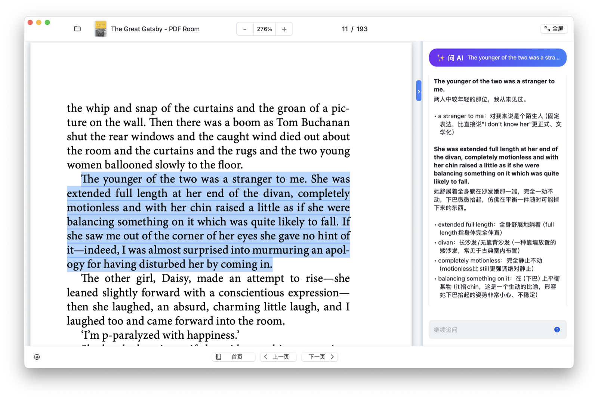

<p align="center">
  
</p>

# Leaf Reader

Leaf Reader is a native macOS PDF reader built with Swift and PDFKit. It focuses on reading flow, quick navigation, text selection, reading progress restore, and an integrated AI assistant for explaining selected passages.



## Features

- Open and read local PDF files.
- Navigate pages with toolbar buttons and keyboard paging.
- Zoom in and out with a compact zoom control.
- Restore the last opened PDF, page, and zoom level.
- Select text and ask the built-in AI panel for explanations.
- Configure AI model, API key, and interface language from settings.

## Repository Layout

- `Leaf Reader.app` - built macOS app bundle.
- `mac-app/main.swift` - native Swift source code.
- `mac-app/AppIcon.icns` - packaged app icon.
- `mac-app/AppIconSource.png` - source image for the app icon.
- `assets/leaf-reader-icon.png` - project icon used in this README.
- `assets/screenshot.png` - screenshot used in this README.

## Run

```sh
open "Leaf Reader.app"
```

## Build

Compile the Swift source into the existing app bundle:

```sh
swiftc mac-app/main.swift \
  -o "Leaf Reader.app/Contents/MacOS/Leaf Reader" \
  -framework Cocoa \
  -framework PDFKit \
  -framework CryptoKit
```

Re-sign the app locally after rebuilding:

```sh
codesign --force --deep --sign - "Leaf Reader.app"
```

## Release

Version `1.0.0` is tagged as `v1.0.0`.

Local release artifacts are generated under:

```text
release/1.0.0/
```

## Requirements

- macOS 12.0 or later.
- Swift toolchain with Cocoa, PDFKit, and CryptoKit frameworks.

## Notes

- Bundle identifier: `com.linlu.leafreader`.
- The checked-in app is ad-hoc signed for local testing and distribution.
- AI requests use the API key configured locally in the app settings.
