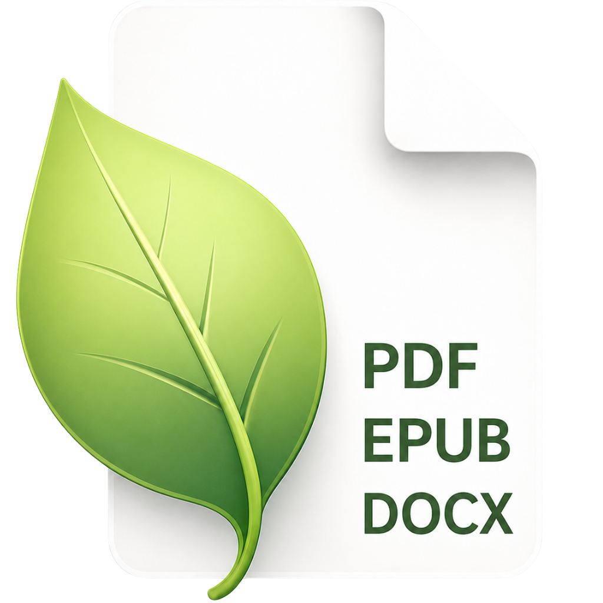
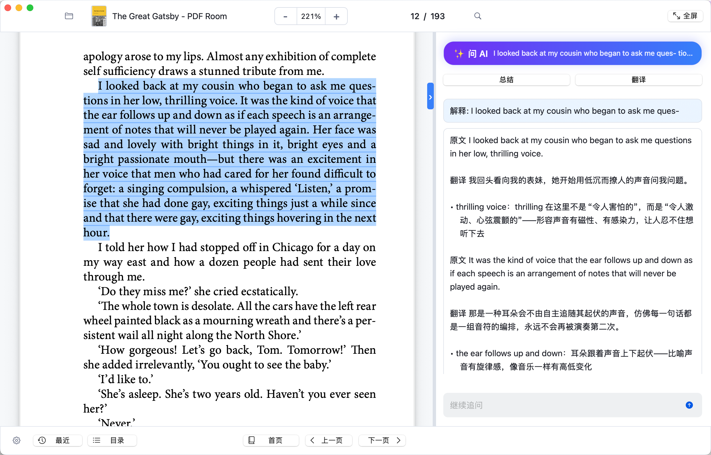
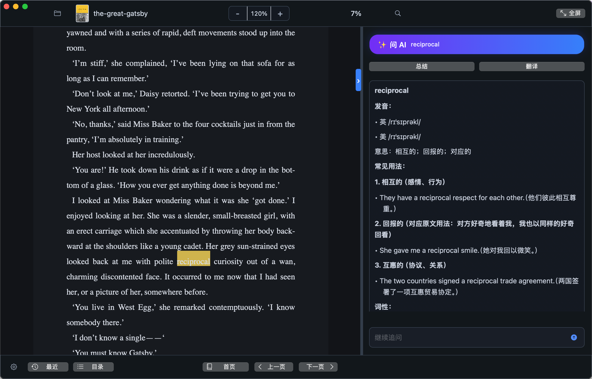

<p align="center">
  
</p>

# Leaf Reader

Leaf Reader is a native macOS reader for PDF, EPUB, and DOCX documents. It is built with Swift, PDFKit, and WebKit, and focuses on a quiet reading experience with fast navigation, document search, reading progress restore, light and dark reader themes, and an optional AI panel for working with selected passages.





## Download

Download the latest macOS installer:

[Leaf Reader 1.0.4 pkg installer](https://github.com/dowellhz/LeafReader/releases/download/v1.0.4/LeafReader-1.0.4.pkg)

## Highlights

- Open local PDF, EPUB, and DOCX files in one macOS app.
- Restore the last opened document, page, zoom level, and reading position.
- Navigate PDFs with toolbar controls, keyboard paging, scroll paging, and direct page-number entry.
- Search documents with `Command+F`, next and previous result controls, and visible result positioning.
- Switch between light and dark reader themes for the document area, search overlay, recent files panel, and AI chat panel.
- Select text and ask the built-in AI assistant to explain, summarize, or translate passages.
- Configure model, API key, interface language, and reader theme from the in-app settings panel.
- Keep documents local; AI requests are only sent when the assistant is used with the configured API key.

## Requirements

- macOS 12.0 or later.
- Swift toolchain with Cocoa, PDFKit, WebKit, and CryptoKit frameworks.
- An API key for AI features, configured inside the app settings.

## Run

Open the checked-in app bundle:

```sh
open "Leaf Reader.app"
```

The app is ad-hoc signed for local testing and distribution.

## Build From Source

Compile the Swift sources into the existing app bundle:

```sh
swiftc mac-app/*.swift \
  -o "Leaf Reader.app/Contents/MacOS/Leaf Reader" \
  -framework Cocoa \
  -framework PDFKit \
  -framework WebKit \
  -framework CryptoKit
```

Re-sign the rebuilt app:

```sh
codesign --force --deep --sign - "Leaf Reader.app"
```

Then run it:

```sh
open "Leaf Reader.app"
```

## Project Layout

- `Leaf Reader.app` - built macOS application bundle.
- `mac-app/*.swift` - native Swift source code.
- `mac-app/AIPrompts.json` - built-in AI prompt definitions.
- `mac-app/AppIcon.icns` - packaged app icon.
- `mac-app/AppIconSource.png` - source image for the app icon.
- `assets/leaf-reader-icon.png` - project icon used in this README.
- `assets/screenshot-light.png` - light mode screenshot.
- `assets/screenshot-dark.png` - dark mode screenshot.
- `release/` - local release artifacts when generated.

## Release

Current version: `1.0.4`

Git tag: `v1.0.4`

Latest installer:

[Leaf Reader-1.0.4.pkg](https://github.com/dowellhz/LeafReader/releases/download/v1.0.4/LeafReader-1.0.4.pkg)

Local release artifacts are expected under:

```text
release/1.0.4/
```

## Notes

- Bundle identifier: `com.linlu.leafreader`.
- PDF rendering uses PDFKit.
- EPUB and DOCX rendering uses WebKit. DOCX support is optimized for readable text extraction rather than exact Word layout fidelity.
- Search selections are kept separate from AI passage selection so search navigation does not accidentally populate the assistant.
- AI requests use the model, endpoint, language, and API key configured locally in the settings panel.
