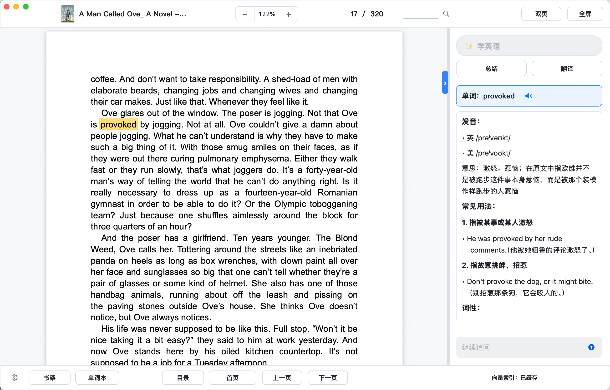
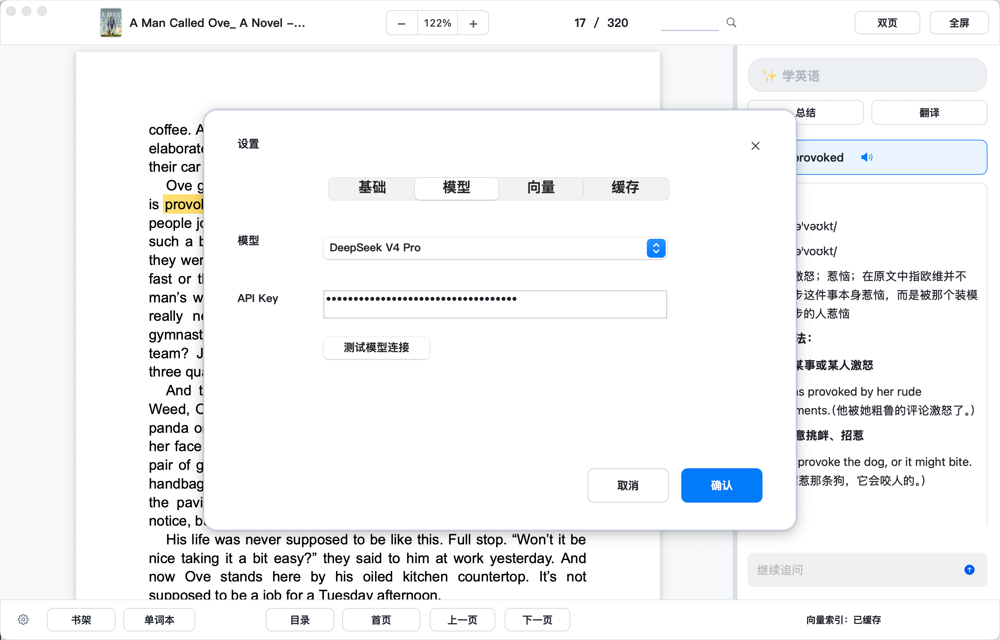
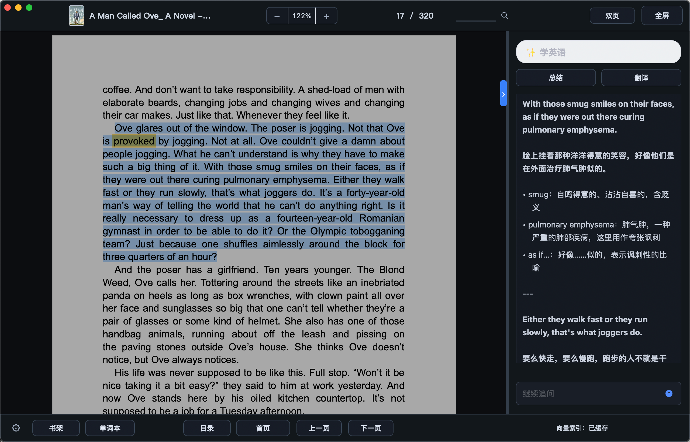
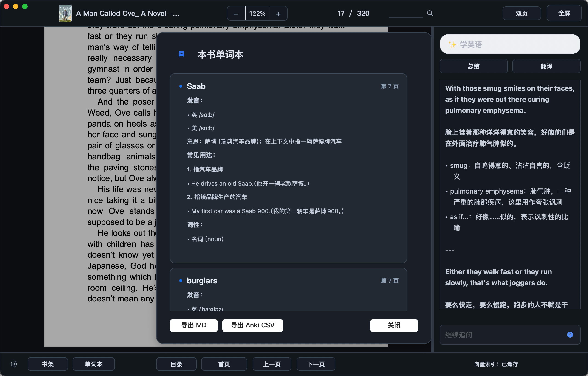

<p align="center">
  
</p>

# Leaf Reader

Leaf Reader is a native macOS reader for PDF, EPUB, and DOCX documents. It is built with Swift, PDFKit, and WebKit, and focuses on a quiet reading experience with fast navigation, document search, reading progress restore, light and dark reader themes, and an optional AI panel for working with selected passages.

## Screenshots










## Download

Download the latest macOS installer:

[Leaf Reader 1.4.18 pkg installer](https://github.com/dowellhz/LeafReader/releases/download/v1.4.18/LeafReader-1.4.18.pkg)

Project website:

https://leafreader.space/

## Highlights

- Open local PDF, EPUB, and DOCX files in one macOS app.
- Restore the last opened document, page, zoom level, and reading position.
- Navigate PDFs with toolbar controls, keyboard paging, scroll paging, and direct page-number entry.
- Search documents with `Command+F`, next and previous result controls, and visible result positioning.
- Switch between light and dark reader themes for the document area, search overlay, recent files panel, and AI chat panel.
- Select text and ask the built-in AI assistant to explain, summarize, or translate passages.
- Configure model, API key, interface language, and reader theme from the in-app settings panel.
- Keep documents local; AI requests are only sent when the assistant is used with the configured API key.

## What's New in 1.4.18

- Added a Copy button at the end of the floating text-selection toolbar for faster PDF and web text copying.
- Fixed PDF right-click behavior so selected text stays selected and PDFKit's native context-menu actions remain available.
- Added automatic Chinese speech voice selection so selected Chinese text can be read aloud when a Chinese system voice is installed.
- Improved diagnostics for recent documents, AI conversations, EPUB cache cleanup, rendered EPUB HTML writes, and word-record storage failures.
- Split reader toolbar and layout code into focused files to make future UI work easier to maintain.

## What's New in 1.4.17

- Improved EPUB loading diagnostics so missing, invalid, or undecodable chapters are reported instead of being silently skipped.
- Made EPUB fallback pages show useful diagnostics when no readable spine content can be loaded.
- Made web reading-position restores and AI source jumps event-driven, improving reliability on large EPUB and DOCX documents.
- Improved reader session progress handling, including clearer handling for missing web progress and safer PDF page saves.
- Hardened AI settings persistence with isolated defaults coverage for model, embedding, and conversation options.
- Split logic tests by domain to make future regression coverage easier to maintain.

## What's New in 1.4.12

- Improved first-load performance by replacing full-file MD5 reads with a fast document identifier while preserving compatible access to existing saved data.
- Added a loading overlay that waits for the initial AI bubble layout before opening the document.
- Reduced AI panel startup work by restoring only recent bubbles first and loading matching historical bubbles on demand.
- Made AI explanations more compact by tightening prompts, Markdown spacing, and blank-line handling between original text and translation.
- Improved PDF scroll paging so moving to the previous page lands at the previous page bottom, reducing apparent skipped-page behavior.
- Reduced resize stutter by debouncing expensive panel and PDF layout refresh work.

## What's New in 1.4.11

- Fixed the manual Check for Updates flow so the update window does not disappear immediately after an update is found.
- Waits for Sparkle's current update check session to fully finish before presenting the standard update UI.

## What's New in 1.4.10

- Improved EPUB table-of-contents parsing for nested NCX entries, HTML nav depth, relative paths, fragments, and query stripping.
- Improved EPUB content compatibility with declared text encodings, HTML entity decoding, internal link navigation, and lazy image loading.
- Hardened EPUB archive/resource path handling and sanitized unsafe embedded HTML content.
- Split EPUB loading logic into focused parser, path resolver, sanitizer, and text decoder helpers with shared logic tests.

## What's New in 1.4.9

- Rotated the Sparkle update signing key and embedded the new update public key.
- Updated release signing to use the project-external Sparkle private key backup.
- This is a manual-install transition release; future updates from this version can use in-app automatic updates again.

## What's New in 1.4.8

- Fixed duplicate AI records when marking EPUB words for Learn English.
- Fixed old word bubbles being restored twice in historical AI conversations.
- Fixed release installers so macOS Installer upgrades Leaf Reader in `/Applications` instead of relocating it to an old app path.

## What's New in 1.4.7

- Optimized EPUB loading with cached unpacking, deferred plain-text extraction, and faster cover reads.
- Fixed EPUB cover/home rendering so the first page opens on the actual cover when available.
- Improved EPUB word highlighting so Learn English marks the selected word immediately and restores highlights more accurately.
- Added clickable EPUB AI source underlines that jump back to the matching AI conversation.
- Added shelf cleanup controls for clearing per-book AI data, word records, vector cache, and reading history.

## What's New in 1.4.6

- Fixed manual update checks so the white "You're up to date" result window is shown after Sparkle reports no update.
- Added a fallback path for update probe cycles that finish successfully without a detailed no-update callback.

## What's New in 1.4.5

- Fixed the release build so macOS 13.6.1 can open Leaf Reader by setting the binary deployment target to macOS 12.0.
- Built the app as a universal macOS binary for both Apple Silicon and Intel Macs.
- Added a white progress window for manual update checks.
- Reduced AI bubble panel relayout work during streaming and text selection.
- Moved shelf cover disk-cache loading off the main thread.

## What's New in 1.4.4

- Replaced the manual "up to date" update check dialog with a Leaf Reader white-background status window.
- Kept Sparkle's update discovery and installation flow for available updates.
- Prevented AppleDouble metadata files from being copied into generated app and installer payloads.

## What's New in 1.4.2

- Added Sparkle-powered in-app update checks.
- Published the GitHub Pages download site and appcast feed.
- Added automated build and release packaging scripts.
- Improved EPUB/DOCX selection clearing when switching to AI bubble selections.

## What's New in 1.4.1

- Refined selection handling between the reading area and AI chat bubbles so only one active selection is kept.
- Preserved AI bubble selections when using follow-up questions, and restored selected bubble text as follow-up context.
- Kept selected passages available for Learn English, Summarize, and Translate actions.

## What's New in 1.4

- Reworked the book vocabulary panel with separate Learn, Review, New Words, and All tabs, paginated word lists, exports, and lower-case review cards.
- Moved word records to SQLite with incremental upsert/delete persistence and production SQLite regression tests.
- Improved drag-and-drop import behavior for one-book and multi-book drops, duplicate handling, bookshelf focus, and recent-reading sorting.
- Added AI conversation trimming, debounced saves, preserved linked word bubbles, and page-jump diagnostics for navigation troubleshooting.
- Fixed embedding provider defaults, SiliconFlow settings, provider-specific API keys, and faster vector scoring with cached embedding norms.
- Split large AI, settings, vocabulary, and storage files into focused modules with broader regression coverage.

## What's New in 1.3.1

- Added drag-and-drop opening for PDF, EPUB, and DOCX files directly in the reader window.
- Added optional AI conversation saving per book, including source page/location for non-vocabulary AI bubbles.
- Clicking saved non-vocabulary AI bubbles can jump back to the recorded page or reading position.
- Improved vector-index state reset when switching books so old cache status is not shown for the new document.
- Split the reader window controller into focused extensions for AI, document loading, embedding, navigation, sessions, UI, and vocabulary logic.

## What's New in 1.3

- Added a bookshelf view with higher-resolution covers, reading progress, add-file support, and contextual actions.
- Improved vocabulary workflows with word aggregation, Anki CSV export, source page/context, pronunciation playback, and safer failed-query handling.
- Added clearer embedding status in the bottom toolbar, including cached, idle, paused, and retry states.
- Improved background indexing so large books open faster and vector generation waits for reader idle time.
- Reworked modal focus handling for settings, bookshelf, and vocabulary panels.
- Added safer cache and word-record clearing with confirmation prompts.

## What's New in 1.2

- Renamed the assistant entry point to `学英语` and improved selected-word and short-phrase explanations.
- Added Markdown rendering for AI answers, reference bubbles, and the book vocabulary panel.
- Added PDF vector retrieval for document Q&A, with current-page priority, background indexing, cache reuse, and index progress in the bottom toolbar.
- Added separate embedding service settings, including OpenAI-compatible providers, local embedding endpoints, custom endpoints, and a separate embedding API key.
- Improved Chinese-to-English retrieval queries when asking Chinese questions about English books.
- Redesigned the settings panel with scrolling layout, clearer fields, and a more visible window edge.
- Reworked the book vocabulary panel into a scrollable card view.
- Improved app stability by replacing fragile sheet-based panels with child windows.

## Requirements

- macOS 12.0 or later.
- Swift toolchain with Cocoa, PDFKit, WebKit, and CryptoKit frameworks.
- An API key for AI features, configured inside the app settings.

## Run

Open a locally built app bundle:

```sh
open "Leaf Reader.app"
```

The app bundle is generated locally and is not committed to git.

## Build From Source

Install Sparkle first:

```sh
brew install --cask sparkle
```

Create the app bundle directory if needed, then compile the Swift sources:

```sh
./scripts/build_app.sh
```

Then run it:

```sh
open "Leaf Reader.app"
```

## Tests

Run the lightweight logic regression tests:

```sh
./tests/run.sh
```

Run the full local pre-commit check, including whitespace checks, tests, and an app build:

```sh
./scripts/check.sh
```

## Project Layout

- `Leaf Reader.app` - generated macOS application bundle, ignored by git.
- `mac-app/*.swift` - native Swift source code.
- `tests/` - lightweight Swift logic regression tests.
- `mac-app/AIPrompts.json` - built-in AI prompt definitions.
- `mac-app/AppIcon.icns` - packaged app icon.
- `mac-app/AppIconSource.png` - source image for the app icon.
- `docs/` - GitHub Pages site and Sparkle update feed.
- `assets/leaf-reader-icon.png` - project icon used in this README.
- `assets/reader-light-ai-word.png` - light mode word-learning screenshot.
- `assets/reader-bookshelf.png` - bookshelf screenshot.
- `assets/reader-settings.png` - settings panel screenshot.
- `assets/reader-dark-ai.png` - dark mode AI reading screenshot.
- `assets/reader-dark-vocabulary.png` - dark mode vocabulary book screenshot.
- `release/` - local release artifacts when generated.

## Code Wiki

Developer notes live in `docs/wiki/`:

- [Code Wiki index](docs/wiki/index.md)
- [Code Map](docs/wiki/code-map.md)

Regenerate the code map after larger refactors:

```sh
./scripts/generate_code_wiki.sh
```

Preview and sync the GitHub Wiki copy:

```sh
./scripts/sync_github_wiki.sh
./scripts/sync_github_wiki.sh --push
```

## Release

Current version: `1.4.18`

Git tag: `v1.4.18`

Latest installer:

[Leaf Reader-1.4.18.pkg](https://github.com/dowellhz/LeafReader/releases/download/v1.4.18/LeafReader-1.4.18.pkg)

Local release artifacts are expected under:

```text
release/1.4.18/
```

Sparkle updates use:

```text
https://leafreader.space/appcast.xml
```

The appcast entry points to the signed and notarized pkg uploaded to GitHub Releases. For pkg updates, update `docs/appcast.xml` manually with the new version, pkg URL, file length, and EdDSA signature from Sparkle's `sign_update` tool.

Build, sign, notarize, staple, and update the Sparkle appcast for a release:

```sh
SPARKLE_PRIVATE_KEY_FILE=/path/to/sparkle-ed25519-private-key ./scripts/release_pkg.sh 1.4.18
```

Run the full publish flow from a clean working tree:

```sh
./scripts/publish_release.sh 1.4.12
```

The publish script runs tests, builds/signs/notarizes the pkg, commits the version/appcast changes, tags the release, pushes `main` and the tag, creates the GitHub Release, uploads the pkg, and verifies the download URL.

The release script accepts `SPARKLE_PRIVATE_KEY` from the environment, `SPARKLE_PRIVATE_KEY_FILE`, `$HOME/.config/leafreader/sparkle-ed25519-private-key`, the local ignored `sparkle-ed25519-private-key` file, or Sparkle's default keychain account.

### Sparkle Key Management

Current `SUPublicEDKey`:

```text
WxXNtAF6ZaqVPUux2Zqcmswgu4LPdhoA1Lb0fEfzckI=
```

The private key is stored in three places on the release machine:

- macOS login Keychain item: `Private key for signing Sparkle updates`
- Primary local backup file outside the repo: `$HOME/.config/leafreader/sparkle-ed25519-private-key`
- Optional repo-local ignored copy: `sparkle-ed25519-private-key`

The backup file must stay out of git and should keep `0600` permissions:

```sh
chmod 600 "$HOME/.config/leafreader/sparkle-ed25519-private-key"
```

After generating a new Sparkle key, immediately export and back it up outside the repo:

```sh
mkdir -p "$HOME/.config/leafreader"
/private/tmp/sparkle-generate_keys -x "$HOME/.config/leafreader/sparkle-ed25519-private-key"
chmod 600 "$HOME/.config/leafreader/sparkle-ed25519-private-key"
/opt/homebrew/Caskroom/sparkle/2.9.2/bin/sign_update --ed-key-file "$HOME/.config/leafreader/sparkle-ed25519-private-key" release/<version>/LeafReader-<version>.pkg
```

Keep an encrypted copy outside this repository, such as in a password manager secure note or an encrypted disk image. Losing the private key breaks automatic updates for apps that already ship with the matching public key.

Changing `SUPublicEDKey` also breaks automatic updates from builds that shipped with the old public key. After a key rotation, publish a manually installed release first; future updates from that release can use the new key.

## Notes

- Bundle identifier: `com.linlu.leafreader`.
- Automatic updates use Sparkle and the public EdDSA key embedded in `mac-app/Info.plist`.
- PDF rendering uses PDFKit.
- EPUB and DOCX rendering uses WebKit. DOCX support is optimized for readable text extraction rather than exact Word layout fidelity.
- Search selections are kept separate from AI passage selection so search navigation does not accidentally populate the assistant.
- AI requests use the model, endpoint, language, and API key configured locally in the settings panel.
