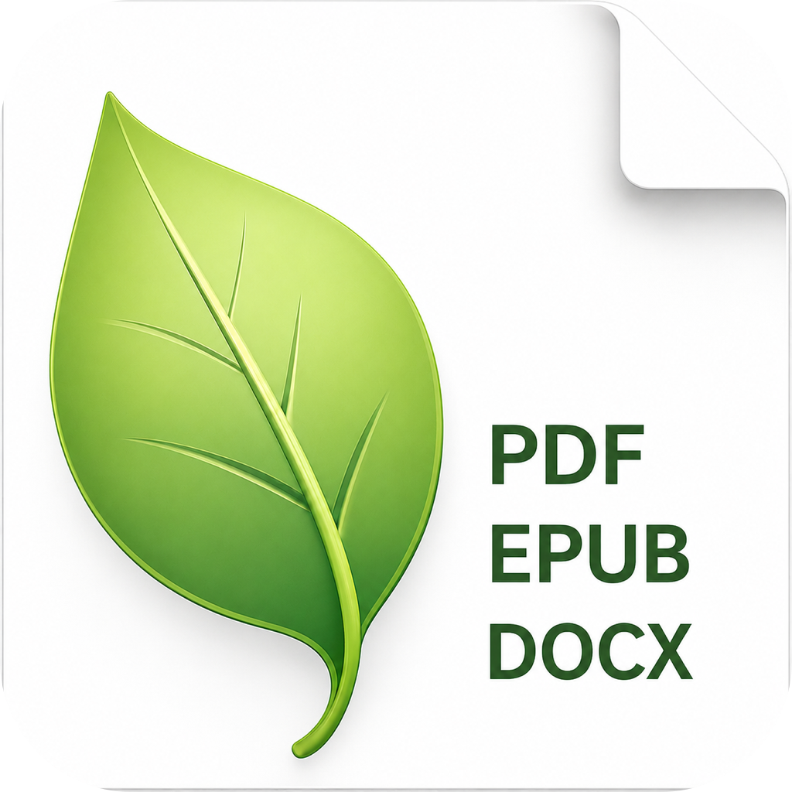
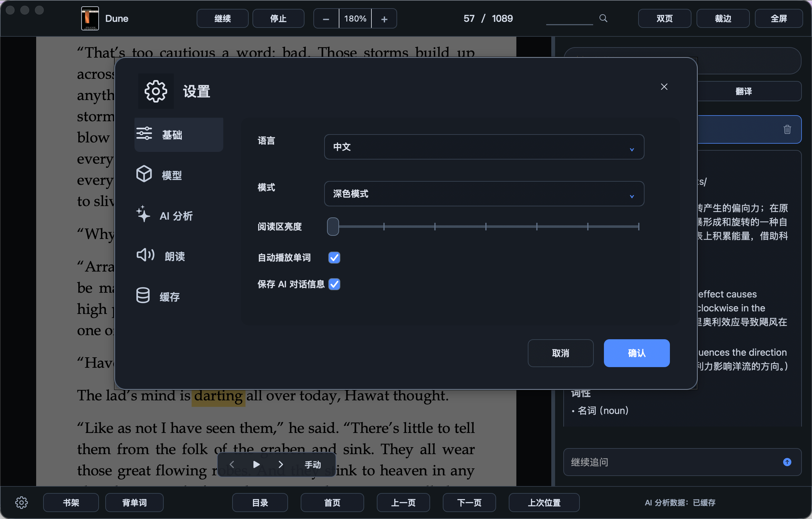
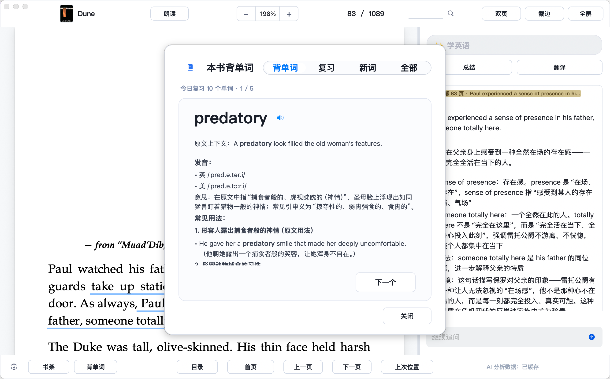

<p align="center">
  
</p>

# Leaf Reader

Leaf Reader is a native macOS reader for PDF, EPUB, and DOCX documents. It is built with Swift, PDFKit, and WebKit, and focuses on a quiet reading experience with fast navigation, document search, reading progress restore, light and dark reader themes, and an optional AI panel for working with selected passages.

## Screenshots






## Download

Download the latest macOS installer:

[Leaf Reader 1.6.1 pkg installer](https://github.com/dowellhz/LeafReader/releases/download/v1.6.1/LeafReader-1.6.1.pkg)

Project website:

https://leafreader.space/

## System Requirements

- macOS 12.0 Monterey or later.
- Apple Silicon or Intel Mac.
- An API key is optional and only needed for AI features.
- Optional Kokoro local speech requires macOS 14.0 or later. KittenTTS local speech supports the app baseline, macOS 12.0 Monterey or later.

## Highlights

- Open local PDF, EPUB, and DOCX files in one macOS app.
- Restore the last opened document, page, zoom level, and reading position.
- Navigate PDFs with toolbar controls, keyboard paging, scroll paging, and direct page-number entry.
- Search documents with `Command+F`, next and previous result controls, and visible result positioning.
- Switch between light and dark reader themes for the document area, search overlay, recent files panel, and AI chat panel.
- Select text and ask the built-in AI assistant to explain, summarize, or translate passages.
- Read selected English text with optional downloadable Kokoro or KittenTTS output; otherwise Leaf Reader falls back to macOS system voices.
- Configure model, API key, interface language, and reader theme from the in-app settings panel.
- Keep documents local; AI requests are only sent when the assistant is used with the configured API key.

## Optional English Speech Runtimes

Leaf Reader can use [FluidAudio Kokoro Core ML](https://huggingface.co/FluidInference/kokoro-82m-coreml) or [kitten_tts_rs](https://github.com/second-state/kitten_tts_rs) for English text-to-speech. Small speech runtime executables are bundled in the installer; large model files are downloaded on demand. Open Settings -> AI Analysis -> Speech to download Kokoro or KittenTTS.

Runtime priority is automatic: KittenTTS first, then Kokoro. Short word or phrase selections use Apple TTS directly.

Runtime OS requirements:

- Kokoro local speech requires macOS 14.0 or later.
- KittenTTS local speech supports macOS 12.0 Monterey or later.
- The main reader app still supports macOS 12.0 Monterey or later. On older systems, Kokoro downloads show a compatibility warning before continuing.

Speech model downloads currently point to the stable `v1.5.10` speech asset release:

- `https://github.com/dowellhz/LeafReader/releases/download/v1.5.10/kokoro-coreml-macos-arm64.tar.gz` (Kokoro ANE/G2P model cache)
- `https://github.com/dowellhz/LeafReader/releases/download/v1.5.10/kitten-tts-rs-macos-arm64.tar.gz` (KittenTTS mini model)

Regular app releases reuse those files. The native runtime binaries are bundled with the app; regenerated speech archives should only be published when model files change, then `SpeechRuntimeResourceManager.Runtime.runtimeAssetsReleaseTag` should be updated to the new asset tag.

Generate speech model packages with:

```sh
./scripts/package_speech_models.sh
```

The packaging script also writes `docs/tts/speech-models-manifest.json` with each asset's file size and SHA256 digest. When model files change, update `runtimeAssetsReleaseTag` to the release tag that will host the new model assets and publish with `--with-speech-models`.

## What's New in 1.6.1

- Reduced the bundled speech footprint by keeping only the espeak English dictionary needed by KittenTTS.
- Trimmed duplicate Kokoro English voices while keeping Bella, Heart, Adam, Emma, and George available.
- Kept KittenTTS and Kokoro local playback working with the smaller bundled runtime resources.

## What's New in 1.6.0

- Refined the reader, AI chat, settings, recent documents, and vocabulary surfaces with a shared theme palette.
- Added SF Symbol icons to the selected-text floating toolbar actions and tightened the toolbar layout.
- Improved AI chat bubble persistence, linked word handling, and source annotations across reading sessions.
- Made embedding lifecycle/status handling more resilient during backfill, rebuild, and document changes.
- Polished vocabulary review/list navigation and recent document cleanup flows.

## What's New in 1.5.11

- Reorganized local speech playback and runtime installation code into smaller focused modules.
- Renamed Kitten-specific playback/progress code to generic read-aloud naming for Kokoro and KittenTTS.
- Reused stable speech model release assets across app releases, so unchanged model archives do not need to be uploaded again.
- Changed future downloadable speech packages to contain model data only while reusing the runtime binaries bundled with the app.
- Improved English sentence splitting and read-aloud source matching for PDF and web-backed documents.

## What's New in 1.5.10

- Bundled the selected Kokoro voice `.bin` files with the app so speech voices are restored locally instead of being downloaded from the cloud.
- Trimmed Kokoro cloud runtime archives so they contain model/runtime files without duplicate voice binaries or source `.mlpackage` directories.
- Kept Kokoro English and Chinese voice installation paths consistent with the selected book language.

## What's New in 1.5.9

- Linked read-aloud progress with saved AI source anchors, so the expanded AI panel scrolls to related analysis while the spoken passage advances.
- Synced read-aloud progress with AI translation and linked word bubbles for PDF, EPUB, DOCX, and web-backed reading views.
- Improved source matching for repeated or partial passages by combining source keys, word IDs, page bounds, and reading progress.
- Split the read-aloud AI tracking logic into a focused module to make future TTS and AI panel behavior easier to maintain.

## What's New in 1.5.8

- Rebuilt the bundled KittenTTS `espeak-ng` helper runtime with a macOS 12.0 deployment target, so KittenTTS local speech matches the app's macOS 12 baseline.
- Added a reusable script for rebuilding the macOS 12-compatible `espeak-ng` and `pcaudiolib` runtime dependencies before release packaging.
- Kept Kokoro downloads available on older macOS versions while showing a compatibility warning when the system is below Kokoro's macOS 14.0 runtime requirement.
- Updated README and the release website to clarify the app, KittenTTS, and Kokoro operating system requirements.

## What's New in 1.5.7

- Updated Kokoro playback to use FluidAudio's `kokoro-ane` English variant with the selected speech speed.
- Made Kokoro match KittenTTS settings behavior: if the required model cache is missing, the Speech settings page shows it as not installed and offers a download button.
- Packaged Kokoro's ANE and G2P model caches together with the runtime download so installing Kokoro fully enables the local model.

## What's New in 1.5.6

- Made speech model downloads write partial files as data arrives, so interrupted GitHub downloads can resume instead of restarting from zero.
- Added automatic retry and HTTP status validation for Kokoro and KittenTTS downloads.
- Added archive validation so server error pages are reported as download failures instead of being passed to `tar`.
- Updated speech runtime download documentation to match the GitHub Release URLs used by the app.

## What's New in 1.5.5

- Fixed speech model deletion so removing Kokoro clears both current and legacy model caches and reports deletion errors instead of silently keeping stale files.
- Prevented deleted or missing speech models from being restarted by TTS warmup or fallback logic.
- Made the speech settings UI stable when both Kokoro and KittenTTS are removed, including disabled model selection and close behavior.
- Put KittenTTS first in speech model selection and download rows, matching the smaller default model path.
- Simplified speech runtime selection and cleanup code so download cancellation, model deletion, and read-aloud backend choice use one shared runtime state.

## What's New in 1.5.4

- Switched generated TTS WAV playback from `NSSound` to `AVAudioPlayer` to improve reliability on Bluetooth/headphone output routes.
- Added playback watchdogs so read-aloud advances instead of hanging when macOS never reports audio completion.
- Started each KittenTTS server on a per-process random local port to avoid connecting to stale server processes from an older app instance.
- Made app termination synchronously stop speech playback and terminate Kokoro/KittenTTS child processes.

## What's New in 1.5.3

- Bundled KittenTTS' required `espeak-ng` runtime, dylibs, and data files so KittenTTS no longer depends on a Homebrew install.
- Made KittenTTS prefer the signed server bundled inside the app while continuing to use downloaded model files.
- Added a build fallback that extracts the bundled KittenTTS server from the speech runtime archive when the local runtime directory is missing.
- Automatically switches speech settings to a newly downloaded runtime when it is the only usable model, or when the previous selection is no longer installed.

## What's New in 1.5.2

- Fixed Kokoro speech status so new installs no longer show Kokoro as installed unless the downloaded model files are complete.
- Made Kokoro playback prefer the signed runtime bundled inside the app while using downloaded model files from the user cache.
- Kept KittenTTS on the smaller bundled server runtime path with models downloaded separately.

## What's New in 1.5.1

- Bundled the small KittenTTS server and Kokoro CLI runtimes inside the app so users only need to download speech models.
- Kept large KittenTTS and Kokoro models outside the installer to reduce package size.
- Made KittenTTS use the bundled server with downloaded user models, and removed the unused CLI fallback path.
- Restarted the KittenTTS server automatically after failed synthesis to recover from stale local server processes.
- Defaulted new speech settings to KittenTTS so the smallest downloadable model path is selected first.

## What's New in 1.5.0

- Improved PDF read-aloud continuation so automatic page turns resume from the top of the next page instead of starting mid-page.
- Stopped active read-aloud immediately when switching or removing books, preventing stale TTS playback from the previous document.
- Reduced PDF TTS highlight overhead by caching active page text during read-aloud progress updates.
- Avoided hidden WebKit selection and highlight cleanup work while reading PDFs, reducing WebContent layer volatility noise.
- Cleaned up PDF read-aloud state handling so pause, resume, stop, and page-change recovery share safer tracking logic.

## What's New in 1.4.18

- Added a Copy button at the end of the floating text-selection toolbar for faster PDF and web text copying.
- Fixed PDF right-click behavior so selected text stays selected and PDFKit's native context-menu actions remain available.
- Added automatic Chinese speech voice selection so selected Chinese text can be read aloud when a Chinese system voice is installed.
- Improved diagnostics for recent documents, AI conversations, EPUB cache cleanup, rendered EPUB HTML writes, and word-record storage failures.
- Split reader toolbar and layout code into focused files to make future UI work easier to maintain.

## What's New in 1.4.17

- Improved EPUB loading diagnostics so missing, invalid, or undecodable chapters are reported instead of being silently skipped.
- Made EPUB fallback pages show useful diagnostics when no readable spine content can be loaded.
- Made web reading-position restores and AI source jumps event-driven, improving reliability on large EPUB and DOCX documents.
- Improved reader session progress handling, including clearer handling for missing web progress and safer PDF page saves.
- Hardened AI settings persistence with isolated defaults coverage for model, embedding, and conversation options.
- Split logic tests by domain to make future regression coverage easier to maintain.

## What's New in 1.4.12

- Improved first-load performance by replacing full-file MD5 reads with a fast document identifier while preserving compatible access to existing saved data.
- Added a loading overlay that waits for the initial AI bubble layout before opening the document.
- Reduced AI panel startup work by restoring only recent bubbles first and loading matching historical bubbles on demand.
- Made AI explanations more compact by tightening prompts, Markdown spacing, and blank-line handling between original text and translation.
- Improved PDF scroll paging so moving to the previous page lands at the previous page bottom, reducing apparent skipped-page behavior.
- Reduced resize stutter by debouncing expensive panel and PDF layout refresh work.

## What's New in 1.4.11

- Fixed the manual Check for Updates flow so the update window does not disappear immediately after an update is found.
- Waits for Sparkle's current update check session to fully finish before presenting the standard update UI.

## What's New in 1.4.10

- Improved EPUB table-of-contents parsing for nested NCX entries, HTML nav depth, relative paths, fragments, and query stripping.
- Improved EPUB content compatibility with declared text encodings, HTML entity decoding, internal link navigation, and lazy image loading.
- Hardened EPUB archive/resource path handling and sanitized unsafe embedded HTML content.
- Split EPUB loading logic into focused parser, path resolver, sanitizer, and text decoder helpers with shared logic tests.

## What's New in 1.4.9

- Rotated the Sparkle update signing key and embedded the new update public key.
- Updated release signing to use the project-external Sparkle private key backup.
- This is a manual-install transition release; future updates from this version can use in-app automatic updates again.

## What's New in 1.4.8

- Fixed duplicate AI records when marking EPUB words for Learn English.
- Fixed old word bubbles being restored twice in historical AI conversations.
- Fixed release installers so macOS Installer upgrades Leaf Reader in `/Applications` instead of relocating it to an old app path.

## What's New in 1.4.7

- Optimized EPUB loading with cached unpacking, deferred plain-text extraction, and faster cover reads.
- Fixed EPUB cover/home rendering so the first page opens on the actual cover when available.
- Improved EPUB word highlighting so Learn English marks the selected word immediately and restores highlights more accurately.
- Added clickable EPUB AI source underlines that jump back to the matching AI conversation.
- Added shelf cleanup controls for clearing per-book AI data, word records, vector cache, and reading history.

## What's New in 1.4.6

- Fixed manual update checks so the white "You're up to date" result window is shown after Sparkle reports no update.
- Added a fallback path for update probe cycles that finish successfully without a detailed no-update callback.

## What's New in 1.4.5

- Fixed the release build so macOS 13.6.1 can open Leaf Reader by setting the binary deployment target to macOS 12.0.
- Built the app as a universal macOS binary for both Apple Silicon and Intel Macs.
- Added a white progress window for manual update checks.
- Reduced AI bubble panel relayout work during streaming and text selection.
- Moved shelf cover disk-cache loading off the main thread.

## What's New in 1.4.4

- Replaced the manual "up to date" update check dialog with a Leaf Reader white-background status window.
- Kept Sparkle's update discovery and installation flow for available updates.
- Prevented AppleDouble metadata files from being copied into generated app and installer payloads.

## What's New in 1.4.2

- Added Sparkle-powered in-app update checks.
- Published the GitHub Pages download site and appcast feed.
- Added automated build and release packaging scripts.
- Improved EPUB/DOCX selection clearing when switching to AI bubble selections.

## What's New in 1.4.1

- Refined selection handling between the reading area and AI chat bubbles so only one active selection is kept.
- Preserved AI bubble selections when using follow-up questions, and restored selected bubble text as follow-up context.
- Kept selected passages available for Learn English, Summarize, and Translate actions.

## What's New in 1.4

- Reworked the book vocabulary panel with separate Learn, Review, New Words, and All tabs, paginated word lists, exports, and lower-case review cards.
- Moved word records to SQLite with incremental upsert/delete persistence and production SQLite regression tests.
- Improved drag-and-drop import behavior for one-book and multi-book drops, duplicate handling, bookshelf focus, and recent-reading sorting.
- Added AI conversation trimming, debounced saves, and preserved linked word bubbles.
- Fixed embedding provider defaults, SiliconFlow settings, provider-specific API keys, and faster vector scoring with cached embedding norms.
- Split large AI, settings, vocabulary, and storage files into focused modules with broader regression coverage.

## What's New in 1.3.1

- Added drag-and-drop opening for PDF, EPUB, and DOCX files directly in the reader window.
- Added optional AI conversation saving per book, including source page/location for non-vocabulary AI bubbles.
- Clicking saved non-vocabulary AI bubbles can jump back to the recorded page or reading position.
- Improved vector-index state reset when switching books so old cache status is not shown for the new document.
- Split the reader window controller into focused extensions for AI, document loading, embedding, navigation, sessions, UI, and vocabulary logic.

## What's New in 1.3

- Added a bookshelf view with higher-resolution covers, reading progress, add-file support, and contextual actions.
- Improved vocabulary workflows with word aggregation, Anki CSV export, source page/context, pronunciation playback, and safer failed-query handling.
- Added clearer embedding status in the bottom toolbar, including cached, idle, paused, and retry states.
- Improved background indexing so large books open faster and vector generation waits for reader idle time.
- Reworked modal focus handling for settings, bookshelf, and vocabulary panels.
- Added safer cache and word-record clearing with confirmation prompts.

## What's New in 1.2

- Renamed the assistant entry point to `学英语` and improved selected-word and short-phrase explanations.
- Added Markdown rendering for AI answers, reference bubbles, and the book vocabulary panel.
- Added PDF vector retrieval for document Q&A, with current-page priority, background indexing, cache reuse, and index progress in the bottom toolbar.
- Added separate embedding service settings, including OpenAI-compatible providers, local embedding endpoints, custom endpoints, and a separate embedding API key.
- Improved Chinese-to-English retrieval queries when asking Chinese questions about English books.
- Redesigned the settings panel with scrolling layout, clearer fields, and a more visible window edge.
- Reworked the book vocabulary panel into a scrollable card view.
- Improved app stability by replacing fragile sheet-based panels with child windows.

## Requirements

- macOS 12.0 Monterey or later.
- Swift toolchain with Cocoa, PDFKit, WebKit, and CryptoKit frameworks.
- An API key for AI features, configured inside the app settings.

## Run

Open a locally built app bundle:

```sh
open "Leaf Reader.app"
```

The app bundle is generated locally and is not committed to git.

## Build From Source

Install Sparkle first:

```sh
brew install --cask sparkle
```

Build the macOS 12-compatible KittenTTS `espeak-ng` helper runtime:

```sh
brew install autoconf automake libtool pkgconf
./scripts/build_espeak_ng_runtime.sh
```

Create the app bundle directory if needed, then compile the Swift sources:

```sh
./scripts/build_app.sh
```

Then run it:

```sh
open "Leaf Reader.app"
```

## Tests

Run the lightweight logic regression tests:

```sh
./tests/run.sh
```

Run the full local pre-commit check, including whitespace checks, tests, and an app build:

```sh
./scripts/check.sh
```

## Project Layout

- `Leaf Reader.app` - generated macOS application bundle, ignored by git.
- `mac-app/*.swift` - native Swift source code.
- `tests/` - lightweight Swift logic regression tests.
- `mac-app/AIPrompts.json` - built-in AI prompt definitions.
- `mac-app/AppIcon.icns` - packaged app icon.
- `mac-app/AppIconSource.png` - source image for the app icon.
- `docs/` - GitHub Pages site and Sparkle update feed.
- `assets/leaf-reader-icon.png` - project icon used in this README.
- `assets/reader-light-ai-word.png` - light mode word-learning screenshot.
- `assets/reader-bookshelf.png` - bookshelf screenshot.
- `assets/reader-settings.png` - settings panel screenshot.
- `assets/reader-dark-ai.png` - dark mode AI reading screenshot.
- `assets/reader-dark-vocabulary.png` - vocabulary review screenshot.
- `release/` - local release artifacts when generated.

## Code Wiki

Developer notes live in `docs/wiki/`:

- [Code Wiki index](docs/wiki/index.md)
- [Code Map](docs/wiki/code-map.md)

Regenerate the code map after larger refactors:

```sh
./scripts/generate_code_wiki.sh
```

Preview and sync the GitHub Wiki copy:

```sh
./scripts/sync_github_wiki.sh
./scripts/sync_github_wiki.sh --push
```

## Release

Current version: `1.6.1`

Git tag: `v1.6.1`

Latest installer:

[Leaf Reader-1.6.1.pkg](https://github.com/dowellhz/LeafReader/releases/download/v1.6.1/LeafReader-1.6.1.pkg)

Local release artifacts are expected under:

```text
release/1.6.1/
```

Sparkle updates use:

```text
https://leafreader.space/appcast.xml
```

The appcast entry points to the signed and notarized pkg uploaded to GitHub Releases. `scripts/release_pkg.sh` regenerates `docs/appcast.xml` with the new version, pkg URL, file length, and EdDSA signature from Sparkle's `sign_update` tool.

Build, sign, notarize, staple, and update the Sparkle appcast for a release:

```sh
SPARKLE_PRIVATE_KEY_FILE=/path/to/sparkle-ed25519-private-key ./scripts/release_pkg.sh 1.6.1
```

Run the full publish flow from a clean working tree:

```sh
./scripts/publish_release.sh 1.6.1
```

The publish script runs tests, builds/signs/notarizes the pkg, commits the version/appcast changes, tags the release, pushes `main` and the tag, creates the GitHub Release, uploads the pkg, and verifies the download URL. Pass `--with-speech-models` only when publishing changed speech model archives in `docs/tts/`.

The release script accepts the Sparkle private key through the configured release-machine environment. Keep the private key out of git and store recovery details only in private operational notes. Losing the private key breaks automatic updates for apps that already ship with the matching public key.

## Notes

- Bundle identifier: `com.linlu.leafreader`.
- Automatic updates use Sparkle and the public EdDSA key embedded in `mac-app/Info.plist`.
- PDF rendering uses PDFKit.
- EPUB and DOCX rendering uses WebKit. DOCX support is optimized for readable text extraction rather than exact Word layout fidelity.
- Search selections are kept separate from AI passage selection so search navigation does not accidentally populate the assistant.
- AI requests use the model, endpoint, language, and API key configured locally in the settings panel.
