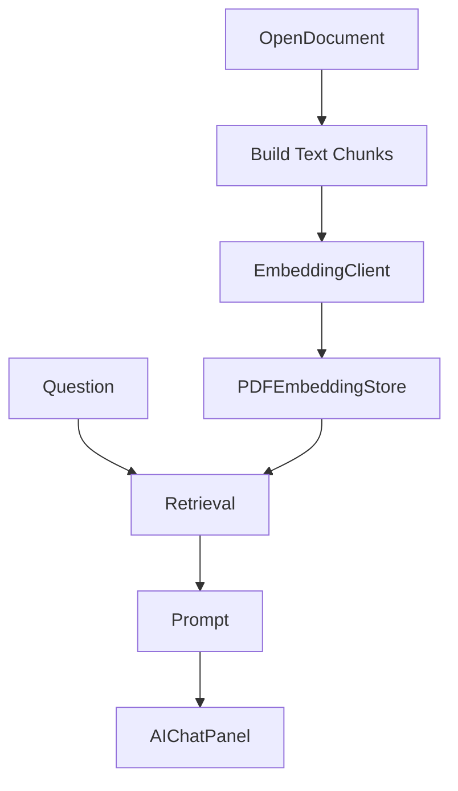

# AI Analysis Cache

AI analysis data is the local embedding/cache layer used for document-aware Q&A.

## Flow

## Files

- `ReaderWindowController+Embedding.swift`: background AI analysis state, progress, cache restore, controls.
- `PDFDocumentAgentIndex.swift`: chunking and retrieval scoring.
- `PDFEmbeddingStore.swift`: local SQLite-backed embedding cache.
- `EmbeddingClient.swift`: embedding API client.
- `AISettingsPanelController*.swift`: model and AI analysis settings UI.

## User-Facing Terms

- UI should prefer “AI analysis data” or “AI reading records” over “vector index” unless the setting is explicitly about an embedding model/provider.
- Current buttons use short labels such as `重分析本书` and `清除本书缓存`.
