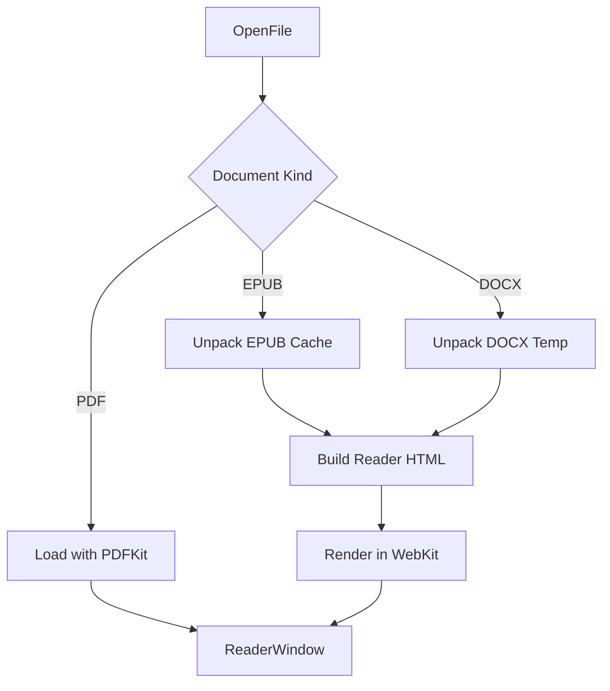

# Document Loading

Leaf Reader supports PDF, EPUB, and DOCX.

## Flow

## Files

- `DocumentLoading.swift`: document kind, shared readable document types, loader entry point.
- `DocumentLoading+Archive.swift`: unzip, EPUB cache root, archive entry reads.
- `DocumentLoading+EPUB.swift`: EPUB package loading, cover, TOC, resource lookup.
- `DocumentLoading+DOCX.swift`: DOCX paragraph/table/media rendering.
- `DocumentLoading+HTML.swift`: HTML rewriting, page wrapper, regex helpers.
- `EPUBPackageParser.swift`, `EPUBPathResolver.swift`, `EPUBHTMLSanitizer.swift`, `EPUBTextDecoder.swift`: focused EPUB logic helpers.

## Notes

- EPUB unpacking is cached under the user cache directory.
- DOCX is unpacked to a temporary directory.
- EPUB and DOCX are rendered through generated HTML in WebKit.
- PDF remains in PDFKit for page navigation and annotation support.
